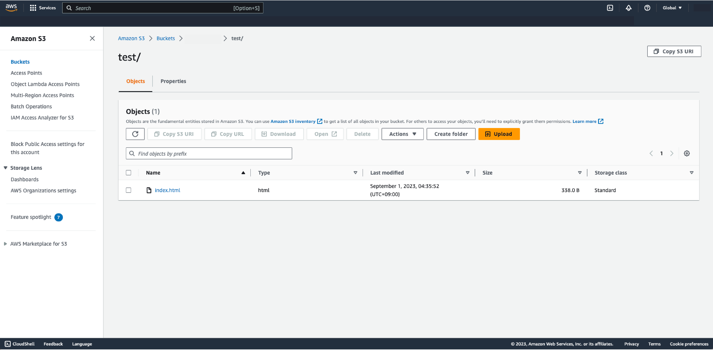

#  File Upload to S3 during deployment process

Upload the file to S3 during the deployment process. This allows you to create or update specific files during the deployment to perform the necessary tasks.

    

## Result

The file will be uploaded to {BUCKET}/{PATH} when the operation is complete.

